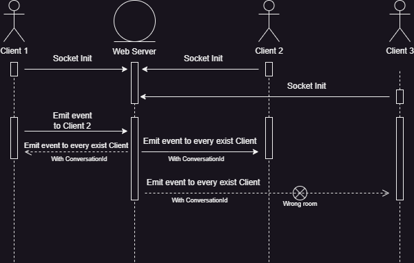

**SocketIO trong Partner**



# **1. Nhắn với admin**

Tổng quát: không tạo room theo socket.io document, mà sẽ tạo từng **Conversation** trong Database => Lúc socket server emit tin nhắn lên Client thì dùng **ConversationId** để biết tin nhắn đó thuộc room nào.

- Ví dụ:
  - Bối cảnh:
    - User 1 chat với User 2 ở Conversation 1
    - User 1 chat với User 3 ở Conversation 2
  - Hành động:
    - User 1 gửi 1 tin nhắn User 2: socket emit từ user 1 lên Server socket để xử lý xong emit về 1 gói tin có chứa **ConversationId**, các User sẽ so sánh **ConversationId (trong gói tin được server trả về)** đó với **ConversationId** của Conversation đang mở trên local để nhận diện gói tin đó có là của mình hay không.

Database: 2 table chính ConversationUsers và MessageUser.

Địa chỉ: WebCustomer - utils – socketNotification.js.

Dòng 154: dùng socket.on(“**send_message_admin**”) có:

    - Input: 1 Object có 2 loại cấu trúc như sau tùy trường hợp:

        - TH1: Emit text:

        ```
        {messageContent: {
            id: cứ để random,
            ConversationId,
            createdAt,
            Content: nội dung tin nhắn,
            Chatting: chứa JSON object thông tin của BookingUser hoặc RegisterPartner,
            Type: "text",
            },
        From: "user",
        With: "admin"
        }
        ```

        - TH2: Emit hình ảnh:

        ```
        {messageContent: {
            id: random,
            ConversationId,
            createdAt,
            Content: file object,
            Chatting: chứa JSON object thông tin của BookingUser hoặc RegisterPartner,
            Type: "file",
            mineType: file.type,
            fileName: file.name,
        },
        From: "user",
        With: "admin",}
        ```

    - Process: ở socket server này, chỉ socket emit (từ client) lên lần lượt text hoặc hình ảnh lên (không emit cả 2 cùng trong 1 object).
    - Ouput: socket trả về 1 Object:
    ```
    {messageContent: {

        id,

        ConversationId,

        createdAt,

        Content**: Id của tấm hình** hoặc **Nội dung** **của tin nhắn**,

        Chatting: chứa JSON object thông tin của BookingUser hoặc RegisterPartner,

        Type: loại của Content: “text” || “file”,
    }}
    ```

# **2. Nhắn với Partner**

Giống hết như ở trên. Khác mỗi cái socket on ở server.

Dòng 154: dùng socket.on(“**send_message**”) có:

    - Input: 1 Object có 2 loại cấu trúc như sau tùy trường hợp:
        - **TH1: Emit text:**
        ```
        {

        id: cứ để random,

        ConversationId,

        createdAt,

        Content: nội dung tin nhắn,

        Chatting: chứa JSON object thông tin của BookingUser hoặc RegisterPartner,

        Type: "text",

        },
        ```

        - **TH2: Emit hình ảnh:**
        ```
        {

        id: random,

        ConversationId,

        createdAt,

        Content: file object,

        Chatting: chứa JSON object thông tin của BookingUser hoặc RegisterPartner,

        Type: "file",

        mineType: file.type,

        fileName: file.name,

        }
        ```

    - Process: ở socket server này, chỉ socket emit (từ client) lên lần lượt text hoặc hình ảnh lên (không emit cả 2 cùng trong 1 object).
    - Ouput: socket trả về 1 Object:
    ```
    {

    id,

    ConversationId,

    createdAt,

    Content: **Id của tấm hình** **hoặc Nội dung của tin nhắn**,

    Chatting: chứa JSON object thông tin của BookingUser hoặc RegisterPartner,

    Type: loại của Content: “text” || “file”,

    }
    ```

**Thông tin server**

google cloud: đăng nhập bằng tài khoản gmail vnplus

máy chủ centos: 35.198.254.31 root/9876543210

mysql root: sử dụng câu lệnh
``` bash
mysql -u root
```

web deploy: hiên tại tất cả các web đang chạy local, sử dụng apache server để proxy ra ngoài.

Web               | Thư mục                              | Phương thức chạy      
-----------------------|-------------------------------------------|-------------------------|
affiliate             | affiliate-booking |  yarn start + tmux |
bookingStudio nodejs backend             | bookingStudioCustomer | pm2 |
Vnplus landing             | VnplusLandingApi | pm2 |
Partner + bookingstudio FE + backend mobile app            | BookingStudioBackend | dotnet |
Plus Stinv backend             | PlusApp | dotnet |


    
